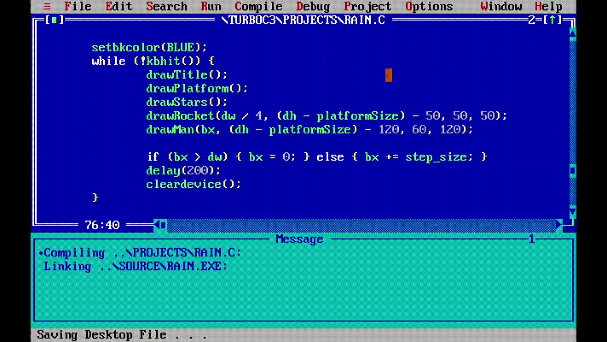
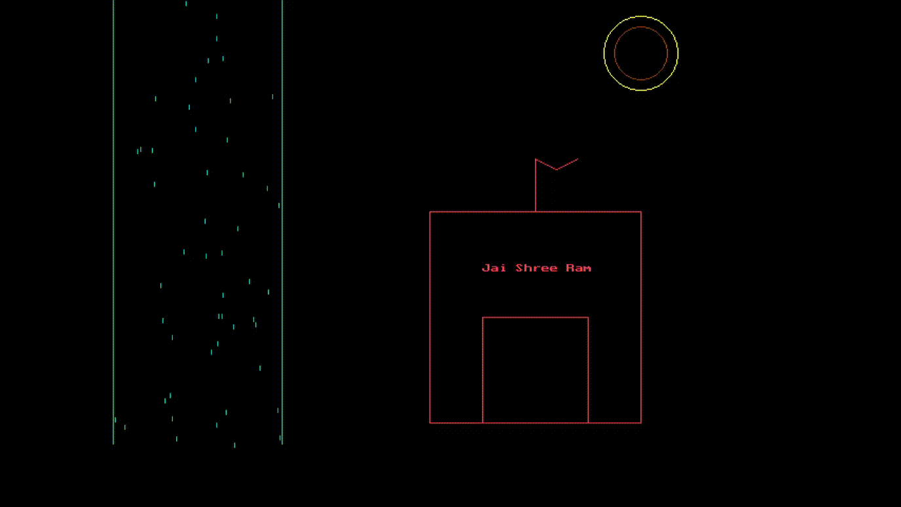

# c-graphics
Graphics implemented in C using `graphics.h`.

- ## Letters
  Contains functions for A-Z letters, ♥ & ⭐.

  

- ## Man on Mars
  A scene of man on Mars.

  

- ## Temple
  A scene of Ram mandir.

  
